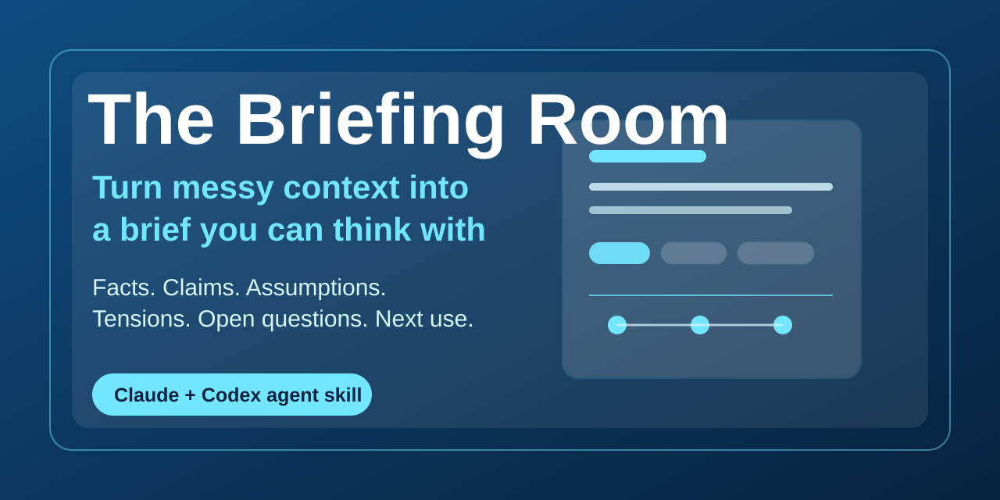

# The Briefing Room



Turn messy context into a brief you can think with.

The Briefing Room is an agent skill for Claude and Codex that organizes scattered notes, transcripts, research dumps, meeting context, strategy thoughts, customer feedback, emails, or half-formed ideas into a structured brief.

The goal is not to summarize away the complexity. The goal is to make the situation readable for a human and usable for deeper thinking.

## Why this exists

Messy context is where a lot of good human judgment gets trapped. Notes, transcripts, fragments, objections, half-formed plans, and emotional stakes all sit in one pile, and a normal summary often compresses away the parts that matter most.

The Briefing Room gives that pile a shape. It separates what is known from what is claimed, what is assumed from what is unresolved, and what the brief is ready for next. Sometimes that next use is Ground Truth, The Quorum, research, drafting, or planning. Sometimes the value is simply helping a person see their own situation clearly again.

## What it does

The Briefing Room separates:

- the top readout
- what is happening
- what matters
- what is known
- what is being claimed or inferred
- what assumptions are carrying the situation
- where the tensions and contradictions are
- what questions remain open
- what next use the brief is ready for

## Install for Claude

Download `briefing-room.skill` from the [latest release](../../releases), then add it through your Skills settings.

## Install for Codex

Ask Codex:

```text
Install my Briefing Room skill from https://github.com/glichtenthal/briefing-room
```

Or install manually:

```bash
python3 ~/.codex/skills/.system/skill-installer/scripts/install-skill-from-github.py \
  --repo glichtenthal/briefing-room \
  --path . \
  --name briefing-room
```

Restart Codex after installation.

## Manual install

The repository is the skill. Copy the complete folder into your agent's skills directory. For example, Codex discovers:

```text
~/.codex/skills/briefing-room/SKILL.md
```

## Good first uses

```text
Use The Briefing Room on these messy notes.
```

```text
Turn this meeting transcript into a structured brief.
```

```text
Organize this context so I can think clearly about what matters.
```

```text
Prepare this for Ground Truth.
```

## How it fits with other skills

- **The Briefing Room** organizes messy context.
- **Ground Truth** pressure-tests the thinking.
- **The Quorum** deliberates consequential decisions.
- **Test Drive** turns plausible ideas into small evidence-seeking trials.

The Briefing Room also stands alone. Sometimes the highest-value output is simply a clearer surface for human judgment.

## More agent skills

- **[Ground Truth](https://github.com/glichtenthal/ground-truth)** - calibrated honesty and anti-sycophancy for plans, decisions, reviews, and ideas.
- **[The Quorum](https://github.com/glichtenthal/the-quorum)** - a five-member expert council that pressure-tests consequential decisions from multiple angles.
- **[Test Drive](https://github.com/glichtenthal/test-drive)** - try an idea before you trust it.

## Build the `.skill` yourself

The repo is the skill. Package it into an installable file with the skill creator tooling:

```bash
python -m scripts.package_skill path/to/briefing-room
```

## Repo layout

```text
briefing-room/
├── SKILL.md
├── agents/
│   └── openai.yaml
├── assets/
│   └── social-preview.svg
├── evals/
│   └── evals.json
├── README.md
├── CHANGELOG.md
└── LICENSE
```

## Version history

See [CHANGELOG.md](CHANGELOG.md).

## License

MIT - see [LICENSE](LICENSE). Use it, fork it, tune it for your own judgment workflows.
